# Extract The Zip File and Open the Project in Visual Studio 2022 or Later


# 🛒 ShopEZ.API

A secure and scalable **E-Commerce Backend Web API** built using **ASP.NET Core Web API**, **Entity Framework Core**, and **SQL Server**.

This project supports **JWT authentication, role-based authorization, product CRUD, and order processing with stock validation**.

---

## 🚀 Features

* 🔐 JWT Authentication
* 👥 Role-based Authorization (Admin/User)
* 📦 Product CRUD Operations
* 🛒 Multi-product Order Placement
* 📉 Automatic Stock Deduction
* ⚠️ Global Exception Middleware
* 🗄️ SQL Server + EF Core Code First
* 🧱 Layered Architecture
* 🧪 Swagger + Postman Testing

---

## 👥 User Roles and Permissions

### 👑 Admin
Admin is responsible for **product management and full order supervision**.

✅ Admin can:
- Register and login
- Create products
- View all products
- Update products
- Delete products
- Delete / cancel **any order**
- Verify stock updates

### 🙋 User
User is responsible for **shopping and managing personal orders**.

✅ User can:
- Register and login
- View products
- Create multi-product orders
- Delete / cancel **only their own orders**

❌ User cannot:
- Add products
- Update products
- Delete products
- Delete other users' orders

---

## 🧱 Architecture

```text
Controller → Service → Repository → DbContext → SQL Server
```

---


## 🔐 Authentication Flow

### Register

`POST /api/auth/register`

### Login

`POST /api/auth/login`

### Token Validity

* ⏱️ 2 Hours

### Roles

* **Admin** → Product management
* **User** → Browse + Order

---

## 📦 Product APIs

* `GET /api/products`
* `GET /api/products/{id}`
* `POST /api/products`
* `PUT /api/products/{id}`
* `DELETE /api/products/{id}`

> Product write APIs are restricted to **Admin role**.

---

## 🛒 Order API

### Create Order

`POST /api/orders`

Supports:

* Multiple products
* Quantity validation
* Stock deduction
* Total calculation

---

## 🗄️ Database Tables

* Users
* Products
* Orders
* OrderItems

### Relationships

* One User → Many Orders
* One Order → Many OrderItems
* One Product → Many OrderItems

---

## ⚙️ Run Locally

### 1) Restore packages

```bash
dotnet restore
```

### 2) Create DB

```bash
dotnet ef migrations add InitialCreate
dotnet ef database update
```

### 3) Run API

```bash
dotnet run
```

### 4) Open Swagger

```text
https://localhost:7215/swagger
```
     
###5) Use Postman for testing with JWT tokens
---

## 🧪 Testing Flow

1. Register Admin
2. Login
3. Copy JWT token
4. Add multiple products
5. Perform Product CRUD
6. Create order
7. Verify stock deduction

---

## 🌟 Highlights

This project demonstrates:

* Repository Pattern
* Service Layer
* DTO usage
* JWT Security
* EF Core Code First
* SQL Server Integration
* Role Segregation
* Clean API Design

---

## 👨‍💻 Author

**Durgaprasad**

Built as part of **.NET Full Stack Development training** and designed to match **trainer + industry standards**.

---

## 📸 API Testing Screenshots

The following screenshots show complete **end-to-end verification of ShopEZ APIs in Postman and SQL Server**.

### 🔐 Authentication

- Admin Registration  
  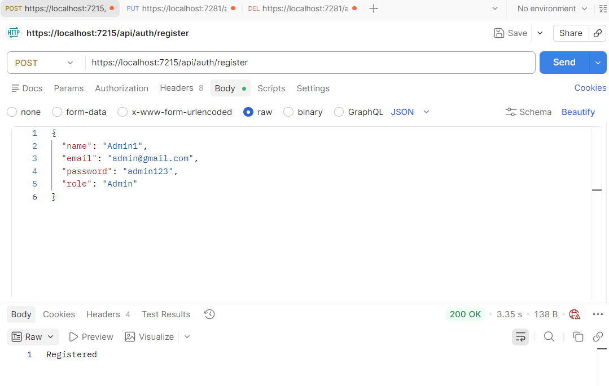

- Admin Login with JWT Token  
  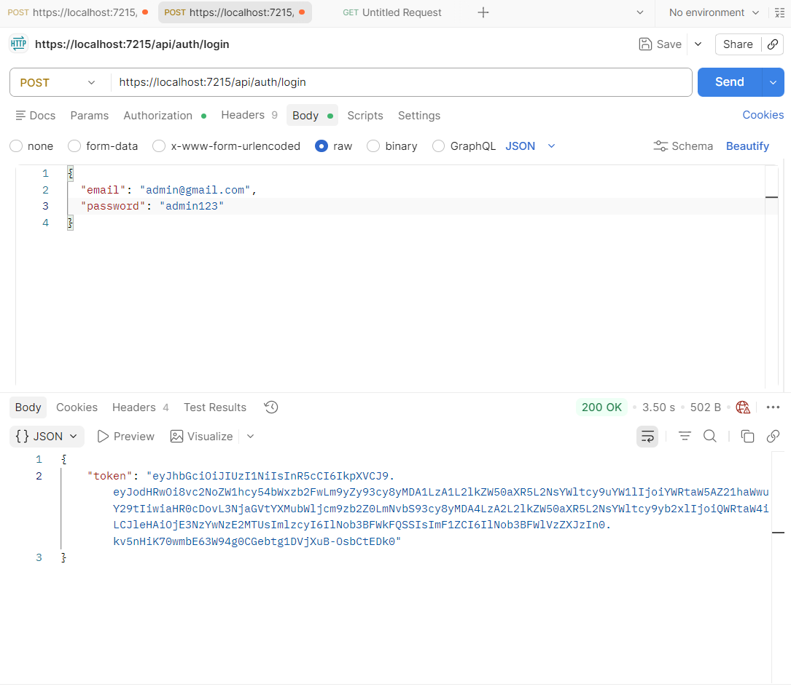

- User Registration  
  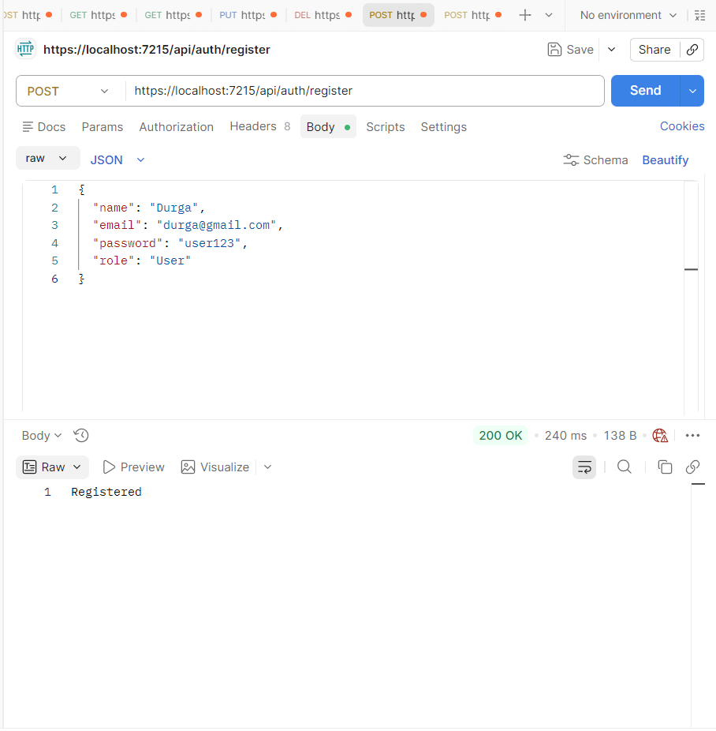

- User Can Cancel Only His Orders
  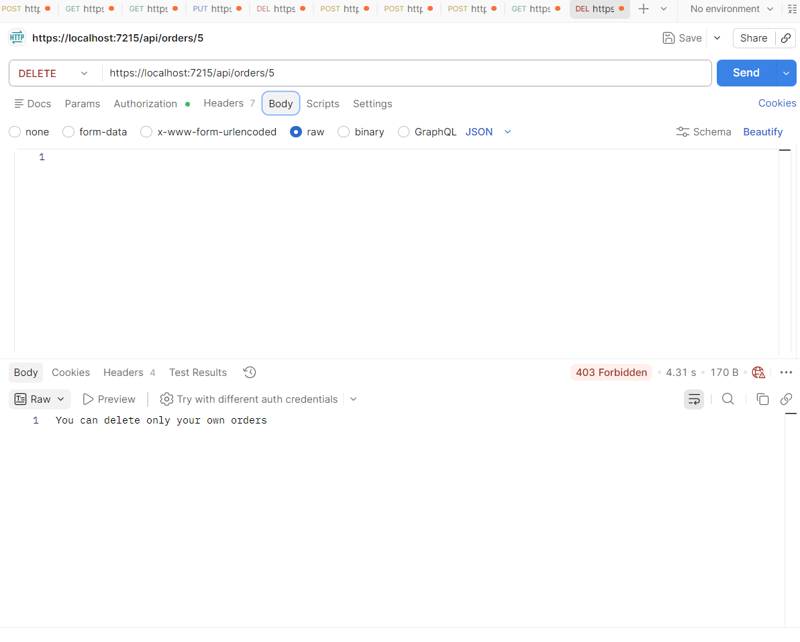


### 📦 Product CRUD

- Create Product  
  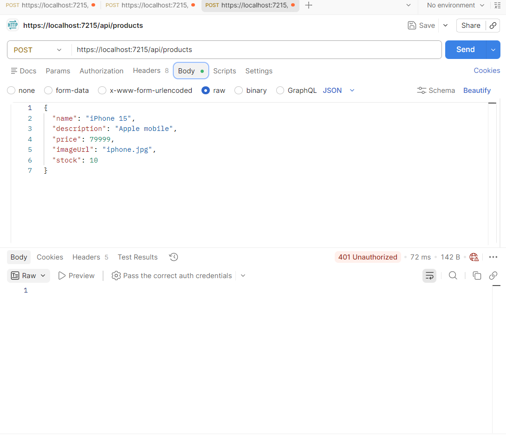

-Get All Products  
  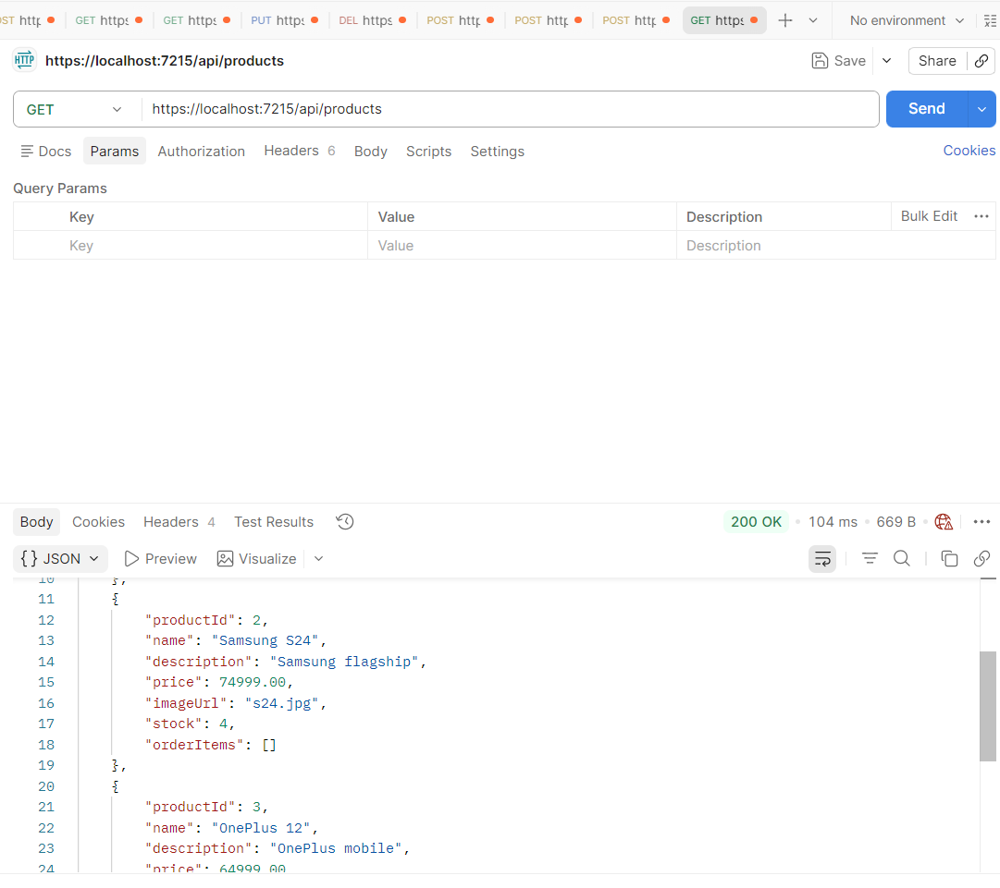

- Get Product By ID  
  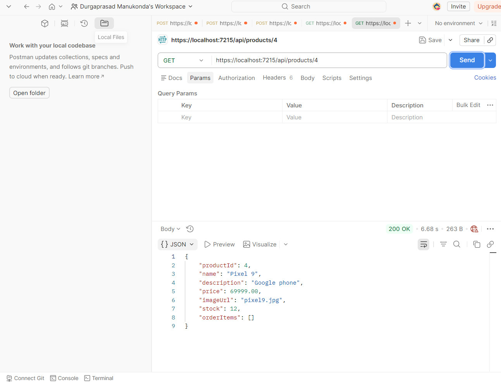

- Update Product  
  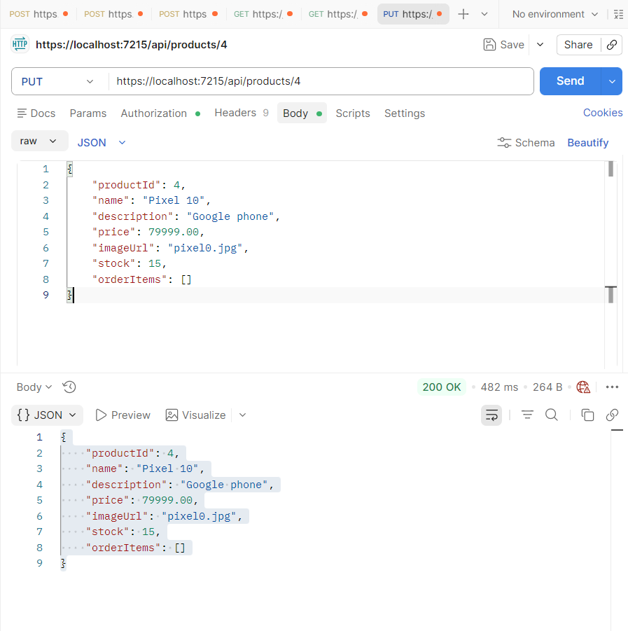

- SQL Verification  
  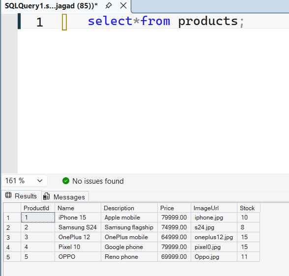

- Delete Product  
  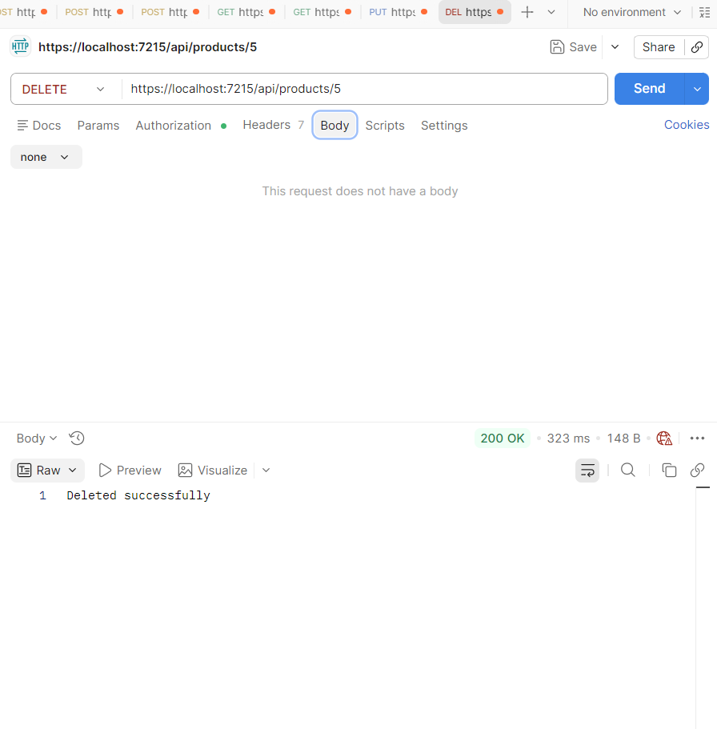

- Forbidden Delete for User  
  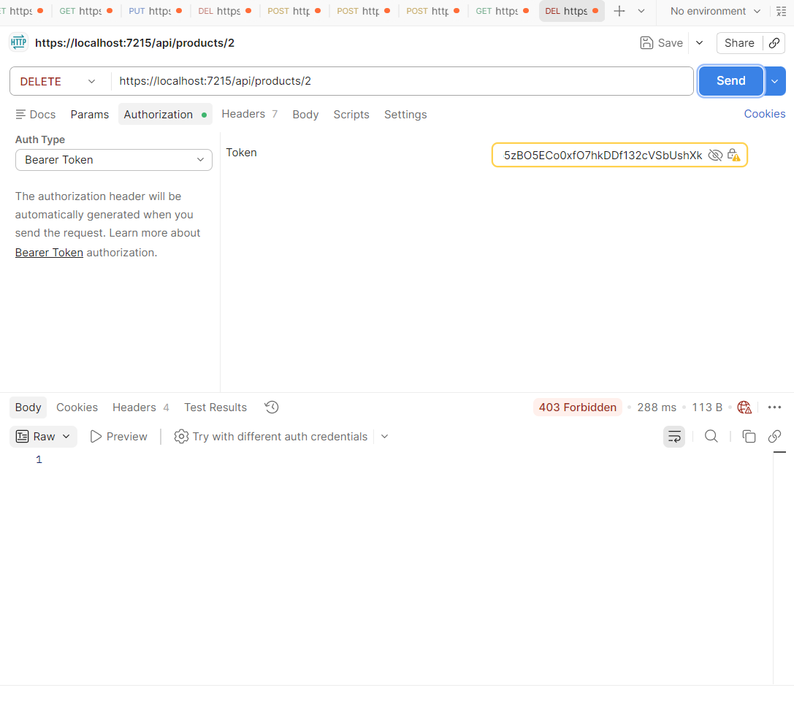

### 🛒 Order Processing

- Create Order  
  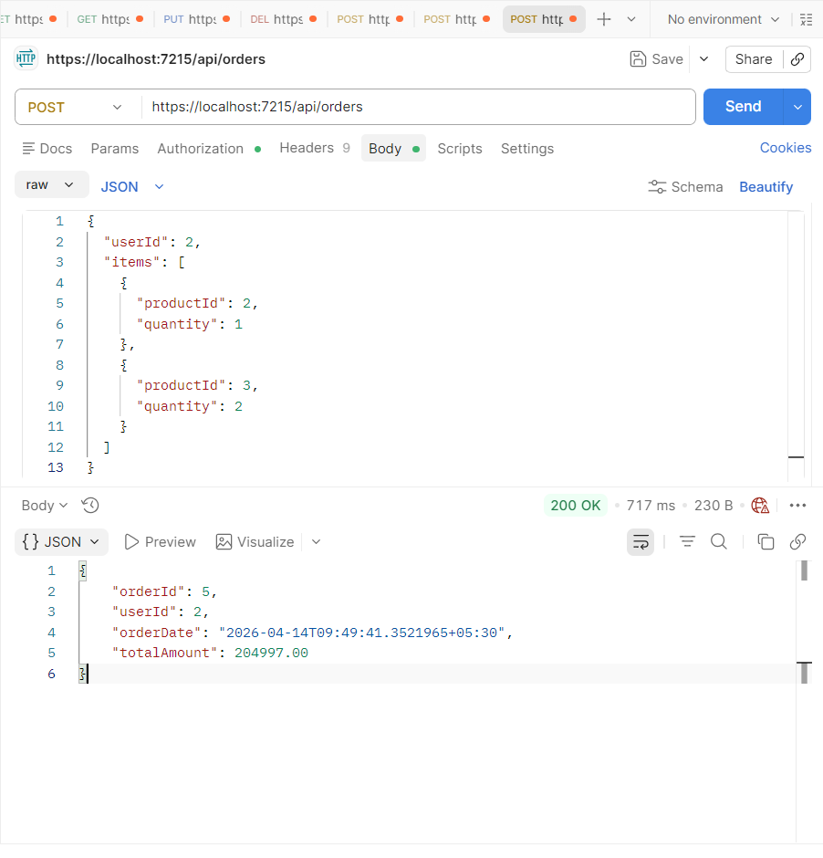

- Delete Order  
  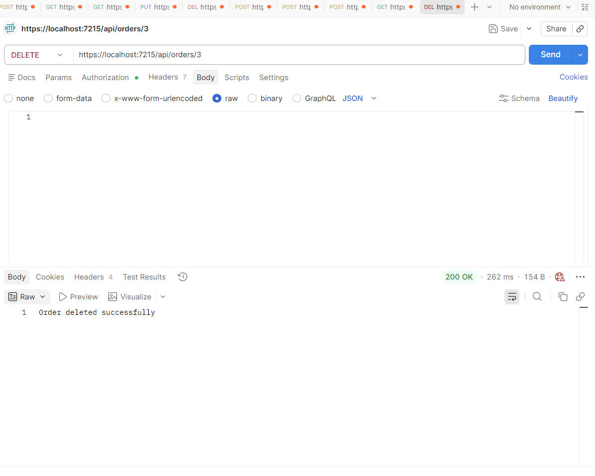


### ✅ Highlights Proven by Screenshots

* JWT Authentication works
* Role-based authorization works
* Product CRUD verified
* Multi-product order creation verified
* Stock deduction verified
* SQL Server persistence verified
* Unauthorized and forbidden flows verified
* Order cancellation verified
